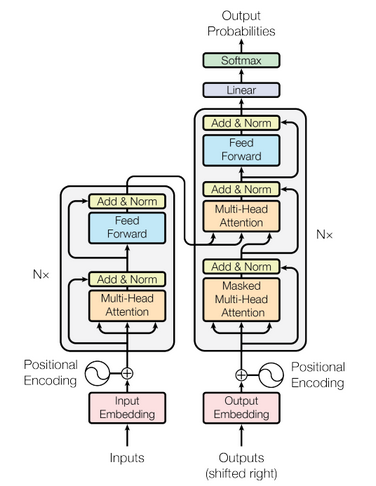

# All about Hugging Face 

## The Pipeline Function
The pipeline function returns an end to end object that performs an NLP task on one or more several tasks

## The carbon footprint of Transformers

Carbon emissions because of training Transformers
 - Fine-tuning is always better than training from scratch
 - Doing a literature review to choose hyperparameters ranges
 - Starting with smaller experiments and debugging
 - Random Search vs Grid Search

## Transfer Learning

The act of initializing a model from another model's weights. Example: IMAGENET, NLP
Usually, it is applied by throwing away the head of the pretrained model while keeping its body

## The Transformer architecture
#### Encoders, decodeers, encoders-decoders

The transformer is based on the attention mechanism
- Split the transformer into two parts, the left side : Encoder, the right side : Decoder
- The encoder "encodes" text into numerical representations
- The encoder has two mechanisms:
  - Bi-directional
  - Self-attention
- The decoder (can also accept texts) has three mechanisms:
  - Uni-directional
  - Auto-regressive
  - Masked self-attention
  - The encoder "decodes" the representations from the encoder

The combination of the two-parts is known as an encoder-decoder, or a sequence-to-sequence transformer

## Encoders
The encoder outputs a numerical representation for each word used as input (Feature Vector or Feature Tensor)

- Bi-directional : context from left and the right
- Good at extracting meaningful information
- Sequence classification, question answering, masked language modeling
- NLU : Natural Language Understanding
- Examples : BERT, RoBERTa, ALBERT

Encoders are good at:
- Masked Language Modelling : fill in the gaps in a sentence
- Sentiment Analysis : good at obtaining an understanding of sequences; and the relationship/interdependence between words

## Decoders
The decoder outputs numerical representation from an initial sequence (Feature Tensor). Decoders differ from Encoders on the Self-attention mechanism.
- Unidirectional : access to their left (or right!) context
- Great at causal task; generating sequences
- NLG : Natural Language Generation
- Example of decoders : GPT-2, GPT Neo

Decoders are good at:
- Causal Language Modeling (Guessing the next word in a sentence)
- 

